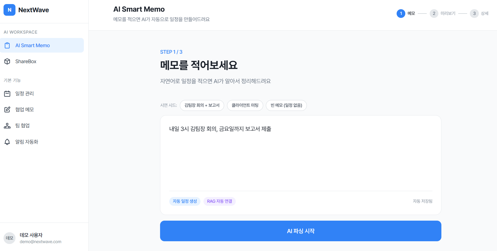

# AI Smart Memo



> 메모를 자연어로 적으면 AI가 일정으로 만들어주는 생산성 SaaS

한 줄짜리 한국어 메모(예: _"내일 3시 김팀장 회의, 금요일까지 보고서 제출"_)를 입력하면 LLM이 일정 후보를 추출하고, 시간 충돌을 자동 감지해 대안 시간을 제안하고, 등록 후엔 RAG로 관련 문서까지 연결해줍니다.

## 1. 문제 정의

직장인의 일정·정보는 카톡, 이메일, 회의록, 메모장 곳곳에 흩어져 있습니다. 결국 캘린더에 옮겨 적는 행위가 추가 비용이 되어 일정이 누락되거나, 옮겨 적더라도 시간 충돌·관련 자료 연결이 사람의 머리에만 남아 있습니다.

- **메모는 쌓이는데 일정으로 이어지지 않는다.** 회의·마감·약속이 자연어로 흘러들어오지만 캘린더 입력은 수동·구조화된 양식이라 마찰이 크다.
- **시간 충돌을 사람이 매번 확인한다.** 캘린더를 일일이 들춰야 더블 부킹을 피할 수 있고, 충돌 시 대안 시간을 잡는 것도 사용자 몫이다.
- **일정과 관련 자료가 분리돼 있다.** 회의 직전에 회의록·기획서를 검색하느라 시간이 새고, 컨텍스트가 끊긴 채 회의가 시작된다.
- **후속 액션이 휘발된다.** 한 회의가 다음 회의를 부르는데, follow-up 미팅 등록은 늘 뒤늦게 떠오른다.

## 2. 사용자 문제 분석

| 페인 포인트                           | 사용자 행동                               | 손실                            |
| ------------------------------------- | ----------------------------------------- | ------------------------------- |
| 자연어 → 캘린더 양식 변환의 인지 비용 | 메모는 적지만 캘린더에 옮기지 않거나 미룸 | 일정 누락, 약속 펑크            |
| 시간 충돌 사전 인지 부족              | 일정 등록 후 뒤늦게 발견                  | 더블 부킹, 재조정 비용          |
| 일정-자료 단절                        | 회의 직전 문서 검색                       | 회의 준비 시간 5–10분/회 낭비   |
| 후속 미팅 누락                        | 회의 종료 후 follow-up 망각               | 의사결정 지연, 액션 아이템 분실 |

핵심은 **"메모를 일정으로 만드는 작업 자체"가 마찰**이라는 점입니다. 사용자는 일정 정보를 이미 자연어로 갖고 있고, 부족한 건 그것을 구조화해 캘린더·문서·후속 미팅과 연결하는 자동화 레이어입니다.

## 3. 기능 설계

위의 4가지 페인 포인트에 1:1로 대응하도록 기능을 설계했습니다.

- **자연어 메모 → 일정 자동 추출**: Gemini가 메모에서 제목·시간·유형(meeting / deadline / event / other)을 추출해 후보 카드로 제시. 사용자는 확인·수정만 하면 됨.
- **시간 충돌 감지 + 대안 시간 제안**: 기존 일정과의 분 단위 겹침을 검사하고, 09–21시 사이 30분 단위로 대안 시간을 최대 3개 제안 (충돌 카드의 칩 클릭 한 번으로 해소).
- **RAG 기반 관련 문서 자동 연결**: 일정 상세 조회 시 FAISS top-10 검색 → 사용자 필터 → 상위 3개를 Gemini로 요약해 `related_docs` + `ai_suggestion`으로 반환.
- **AI 후속 제안 (Suggestion)**: 회의 등록 후 자연스러운 follow-up 미팅을 제안하고, **일정 만들기** 한 번으로 캘린더에 즉시 반영.
- **Google Calendar 동기화**: 일정 일괄 등록 시 Google Calendar에 동시 생성, 실패 건은 `failed[]`로 분리해 사용자에게 토스트.
- **Mock 모드**: `VITE_USE_MOCK=true` 한 줄로 백엔드 없이도 시연 가능 — 데모/심사 환경에서 백엔드 의존성을 제거.

## 4. 시스템 구조

### 기술 스택

**프론트엔드**


**백엔드**


**AI / 벡터 검색**


**배포 / 인프라**


**외부 연동**


### 컴포넌트 구성

```
[ User ] ─▶ [ React SPA (Vite) ]
                  │  axios + Zustand + TanStack Query
                  ▼
            [ FastAPI Server ]
              │        │        │
              ▼        ▼        ▼
      [ JSON Store ] [ FAISS Index ] [ Gemini API ]
       notes.json     IndexFlatL2     • 파싱 / 요약
       schedules.json  768-dim         • 임베딩
                                     [ Google Calendar API ]
```

- **저장소**: `backend/DB/notes.json`, `schedules.json` — flat JSON 파일이 시스템 오브 레코드. 매 요청 시 전체 파싱 후 Python에서 필터링 (데모 스케일에 적합).
- **벡터 인덱스**: 단일 글로벌 `IndexFlatL2(768)` 인덱스 + `id_map.json`으로 row → `(note_id, user_id)` 매핑. 사용자 필터링은 검색 후 `id_map`에서 수행.
- **Two-phase note → schedule**: `POST /notes` → `POST /parse` → 사용자 확인 → `POST /schedules`. 마지막 단계에서 충돌 시 HTTP 409로 부분 성공 없이 실패.
- **RAG summary 캐시**: `StoredSchedule.rag_summary`에 캐싱, 노트 변경 시 `invalidate_rag_summary_cache(user_id)` + `rebuild_note_index()`로 무효화.

### 프로젝트 구조

```
ai-smart-memo-monorepo/
├── frontend/
│   ├── src/
│   │   ├── pages/           # 6개 화면 (Memo / ShareBox / Calendar / Notes / Team / Notification)
│   │   ├── components/      # shell, memo, sharebox, calendar, common
│   │   ├── stores/          # Zustand: memoStore, scheduleStore, shareBoxStore, uiStore
│   │   ├── services/        # mock/real API 스위치 (services/index.ts)
│   │   ├── data/            # mock 시연 데이터
│   │   ├── hooks/           # useDebounce, useToast
│   │   ├── types/api.ts     # API contract TS 타입
│   │   └── router/          # React Router 설정
│   ├── Dockerfile
│   └── package.json
│
├── backend/
│   ├── main.py              # FastAPI app + 12개 엔드포인트
│   ├── schemas.py           # Pydantic 모델 (extra="forbid")
│   ├── services/            # ai_service (Gemini), db_handler, calendar
│   ├── DB/                  # notes.json + schedules.json + faiss_index/
│   └── requirements.txt
│
├── api_contract.md          # API 명세 (Single Source of Truth)
└── README.md
```

## 5. 구현 방식

### 3-step memo flow

`useMemoStore.step` 하나로 화면 전환을 통제하고, **각 단계의 진입 트리거를 단일 액션으로 한정**해 흐름이 꼬이지 않도록 했습니다.

1. **STEP 1 — 입력**: textarea + AI 파싱 시작 버튼. `saveAndParse()`가 `memoApi.create → memoApi.parse`를 순차 호출, 성공 시에만 step 2로 진입.
2. **STEP 2 — 검토/편집**: `parsedEvents`를 인플레이스 편집(`updateEventField`, `removeEvent`). 충돌 카드에서 제안 시간 칩 클릭 시 시작·종료 시간이 duration을 보존한 채 swap.
3. **STEP 3 — 결과**: `scheduleStore.fetchScheduleDetail(id)`가 lazy 로딩, 동일 id 재조회는 `scheduleDetails` 캐시로 short-circuit.

### 충돌 감지 알고리즘

- 분 단위(`minutes since midnight`)로 변환 후 `[start, end)` 구간 겹침 검사.
- `time` 또는 `duration_min`이 없는 일정(마감, 종일 등)은 충돌 대상에서 제외.
- 대안 시간은 09:00–21:00 범위에서 30분 단위로 슬롯을 훑어 빈 자리 최대 3개 반환.
- **두 곳에서 검사**: (1) `POST /parse` 때 후보별로, (2) `POST /schedules` 때 기존 일정 + 요청 배치 내부 모두에 대해 — 두 번째 검사에서 하나라도 겹치면 409로 전체 거부 (부분 생성 없음).

### RAG 파이프라인

```
note 작성/삭제
  ▼
임베딩(text-embedding-004) → FAISS rebuild + id_map.json 갱신
                                   │
                                   ▼
GET /schedules/{id} (캐시 미스 시)
  ▼
검색 쿼리 = schedule.title + description
  ▼
FAISS top-10 → user_id 필터 → 본인 source_note 제외 → 상위 3개
  ▼
Gemini로 요약 생성 → StoredSchedule.rag_summary에 캐싱
```

캐시는 같은 사용자의 노트가 변경될 때만 무효화되어, 일반적인 조회는 디스크 + Gemini 비용 없이 응답.

### Mock / Real 스위치

`services/index.ts`가 모듈 평가 시점에 `VITE_USE_MOCK`을 읽어 도메인별로 mock/real을 결정. `mock.ts`는 `realApi`와 동일한 응답 셰이프를 보장하므로 컴포넌트·스토어는 어떤 구현인지 알 필요가 없음. 데모 환경에서는 백엔드 없이도 충돌 케이스·RAG·후속 제안 시연이 가능.

### 데모 안정화

`App.tsx`가 마운트 시 `POST /api/admin/reset`을 호출, 매 페이지 로드마다 시드 데이터로 초기화. 시연 중 누가 어떤 메모를 적었더라도 새로고침 한 번으로 깨끗한 상태로 복귀합니다.

## 6. 구현 결과

### API 엔드포인트 (12개)

| EP  | Method | Path                             | 설명                                    |
| --- | ------ | -------------------------------- | --------------------------------------- |
| 1   | GET    | `/api/notes`                     | 메모 목록 조회                          |
| 2   | POST   | `/api/notes`                     | 메모 생성 (백그라운드 임베딩)           |
| 3   | DELETE | `/api/notes/{id}`                | 메모 삭제                               |
| 4   | POST   | `/api/parse`                     | 메모 → 일정 후보 추출 (Gemini)          |
| 5   | POST   | `/api/schedules`                 | 일정 일괄 등록 (Google Calendar 동기화) |
| 6   | GET    | `/api/schedules?from=&to=&type=` | 캘린더 뷰용 일정 조회                   |
| 7   | GET    | `/api/schedules/{id}`            | 일정 상세 + RAG + AI 제안               |
| 8   | GET    | `/api/calendar/conflicts`        | 시간 충돌 단독 조회                     |
| 9   | GET    | `/api/sharebox?q=&category=`     | ShareBox 검색/필터                      |
| 10  | POST   | `/api/sharebox`                  | ShareBox 문서 추가                      |
| 11  | GET    | `/api/sharebox/{id}`             | ShareBox 문서 상세                      |
| 12  | POST   | `/api/suggestions/{id}/accept`   | AI 제안 수락 → 일정 등록                |

전체 명세는 [`api_contract.md`](./api_contract.md). 모든 응답은 JSON, 에러는 `{"error": {"code", "message", "detail?"}}`로 통일.

### 프론트엔드 화면 (6개)

`/memo`, `/sharebox`, `/calendar`, `/notes`, `/team`, `/notifications` — 단일 `DemoLayout` shell + 사이드바 + `<Outlet/>` 구조.

### 시연 시나리오

**🅰 Happy Path — 메모 → 파싱 → 등록 → 캘린더**

1. `/memo`에서 **"김팀장 회의 + 보고서"** 시드 칩 클릭 (또는 직접 입력)
2. **AI 파싱 시작** → ~800ms 후 STEP 2로 자동 전환
3. 카드 2장 표시 — _김팀장 회의(⚠ 충돌)_, _보고서 제출(종일)_
4. 충돌 카드의 **"15:30으로 변경"** 클릭 → 시간 자동 조정 + 충돌 해소
5. **"2개 일정 모두 등록"** → STEP 3
6. 사이드바 **일정 관리** → 4월 캘린더에서 신규 일정 확인

**🅱 RAG — 관련 문서 자동 연결**

1. STEP 3 카드의 📎 **연관 문서** 클릭 → `/sharebox`로 이동
2. 검색창에 **"김팀장"** 입력 → 300ms debounce 후 매치 문서만 표시
3. 카테고리 **"회의록"** 선택 → 회의록만 필터링

**🅲 AI 제안 → 캘린더 즉시 반영**

1. STEP 3에서 SuggestionBox **"💡 AI 제안 — QA 킥오프 미팅"**의 **일정 만들기** 클릭
2. 모달 오픈 → **확인** → 토스트 _"일정이 등록됐어요"_ + **"캘린더 보기"** 액션
3. `/calendar`에 신규 일정 즉시 표시

## 7. 서비스 개선 효과

- **일정 등록 마찰 제거**: 메모 한 줄 → 일정 카드까지 단일 클릭(AI 파싱 시작) — 사용자가 캘린더 양식을 인지·작성할 필요 없음. 자연어가 곧 입력 인터페이스.
- **더블 부킹 사전 차단**: 등록 단계 이전(파싱 시점)부터 충돌을 감지하고, 대안 시간을 칩 한 번으로 적용 → 사용자가 별도 캘린더 확인 없이 의사결정.
- **회의 준비 시간 단축**: 일정 상세를 열면 RAG가 관련 회의록·기획서를 자동 연결 → 회의 직전 5–10분의 검색 시간을 0에 수렴.
- **후속 액션 누락 방지**: AI Suggestion이 회의 직후 자연스러운 follow-up을 선제 제안 → "다음에 정리해야지"가 즉시 등록 가능한 일정으로 전환.
- **확장성**: Mock/Real 스위치, JSON 저장소 → DB 교체, 단일 인덱스 → per-user 인덱스로의 점진적 확장이 모두 인터페이스 변경 없이 가능. 데모 단계의 PoC가 운영 시스템으로 자라날 수 있는 구조.
